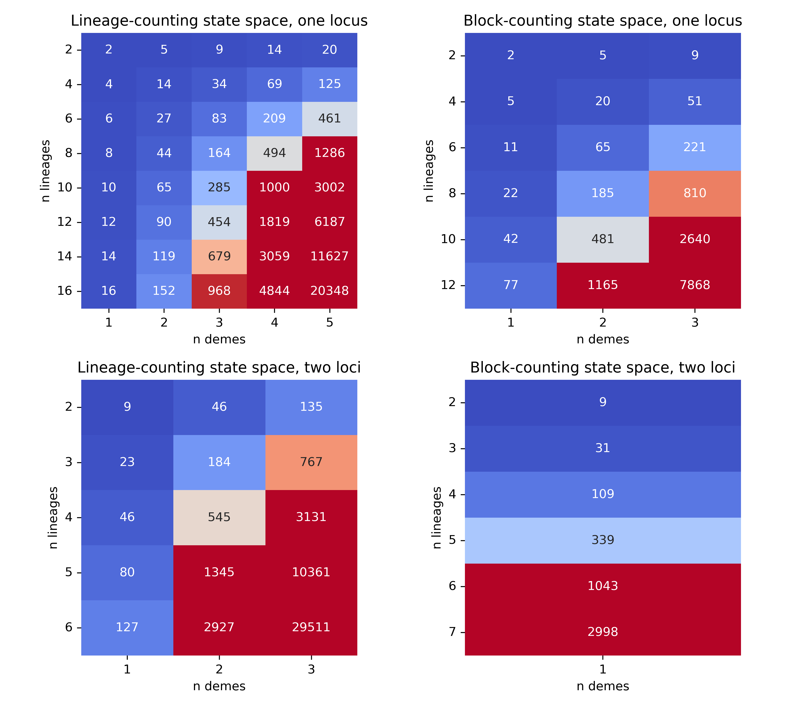
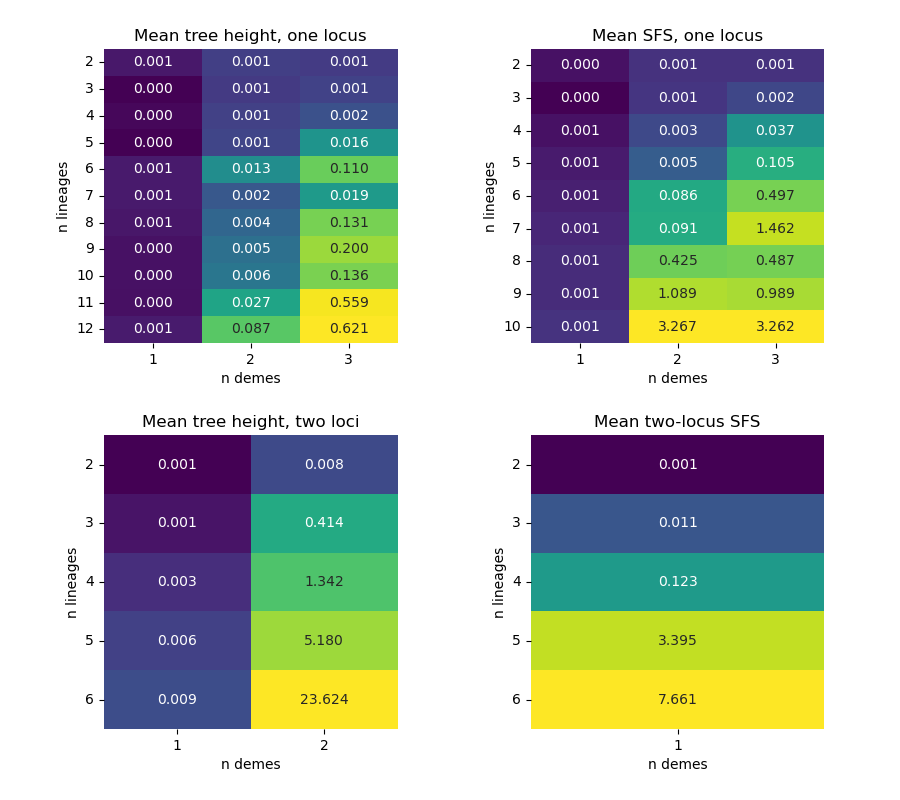

.. _reference.performance:

Performance
===========

State Space Size
----------------
The size of the state space can grow rapidly with the complexity of the demographic scenario, i.e. the number of lineages, demes and loci as shown below.

State Space Construction
------------------------
Constructing the state space (enumerating the states and assembling the rate matrix) is accelerated with `numba <https://numba.pydata.org/>`__, speeding it up by one to several orders of magnitude for larger state spaces. The acceleration is applied automatically (numba is a required dependency); it can be disabled by setting :attr:`~phasegen.settings.Settings.use_numba` to ``False``, in which case construction uses the pure-Python implementation.

Runtime
-------
To obtain moments we need to exponentiate matrices whose size equals the state space size times ``k+1`` where ``k`` is the order of the moment. Matrix exponentiation in general has a cubic runtime (depending on the state space's sparseness), which makes the runtime very sensitive to the size of the state space. In addition, the runtime is linear in the number of epochs introduced. For large state spaces the moments are instead obtained from the *action* of the matrix exponential on a vector (threaded through the epochs), which exploits the sparsity of the rate matrix and avoids forming the dense exponential, giving a substantial speedup for large/high-order/multi-epoch computations (the threshold is controlled by :attr:`~phasegen.settings.Settings.expm_action_min_dim`). Several further optimizations cut the runtime where they apply: the block-counting state space of the single-population standard-coalescent SFS is *flattened* onto the much smaller lineage-counting space, the final unbounded epoch is solved in closed form rather than by exponentiating over the estimated absorption time (:attr:`~phasegen.settings.Settings.closed_form_last_epoch`), and the per-bin solves of a whole spectrum are *batched* into one shared computation. Below we can see the total runtime in seconds for computing the mean tree height, the mean SFS, and the mean two-locus SFS under a 1-epoch standard coalescent over a range of different numbers of lineages and loci.

