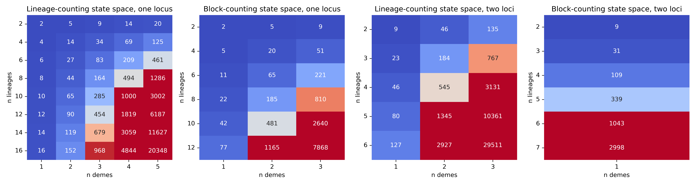

.. _reference.performance.state_space:

State Space
===========
The size of the state space can grow rapidly with the complexity of the demographic scenario, i.e. the number of lineages, demes and loci as shown below.

Constructing it (enumerating the states and assembling the rate matrix) is accelerated with `numba <https://numba.pydata.org/>`__.
